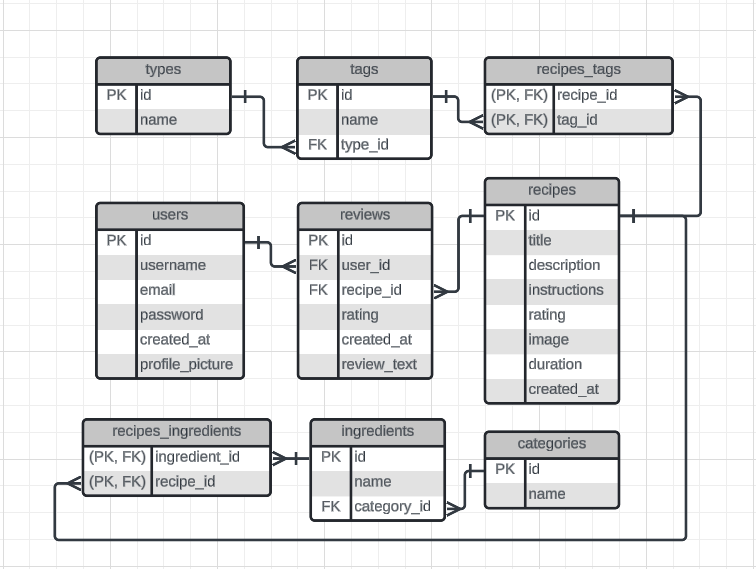

# Ning's Kitchen
Discover and explore personalized recipes tailored to your taste!

## Table of Contents

- [Project Overview](#project-overview)
- [Disclaimer](#disclaimer)
- [Features](#features)
- [Installation](#installation)
- [Usage](#usage)

## Project Overview

**Ning's Kitchen** is a responsive recipe website designed to provide users with a seamless and engaging experience in discovering and managing recipes. The application is built with a Java Spring Boot backend and a PostgreSQL database utilizing PL/pgSQL for stored procedures and functions, ensuring robust data management. The frontend is developed using React and TypeScript, offering a modern and interactive user experience.
Further development is underway to enhance the website's functionality and user experience, with plans to introduce more features and improvements.

## Disclaimer

This project is currently under active development and is part of my personal portfolio. It is intended to showcase my skills in fullstack development. Please note:
- This project is not suitable for production use due to its experimental nature and ongoing development. 
- It is intended for demonstration purposes only.
- Features are being actively added and refined.

## Features

- **Recipe Display** _(Implemented)_: Features a homepage with sections for "Today’s Recipes" and "Newest Recipes," providing users with fresh and relevant content.
- **Dynamic Navigation System** _(Implemented)_: Allows users to filter recipes using multi-select dropdown menus, with support for dietary restrictions, meal types, cuisines, and more, all managed through URL-based state management.
- **Upcoming Feature** _(Ongoing)_: Placeholder

## Database Schema
The following diagram illustrates the structure of my database:

## Installation

## Usage
